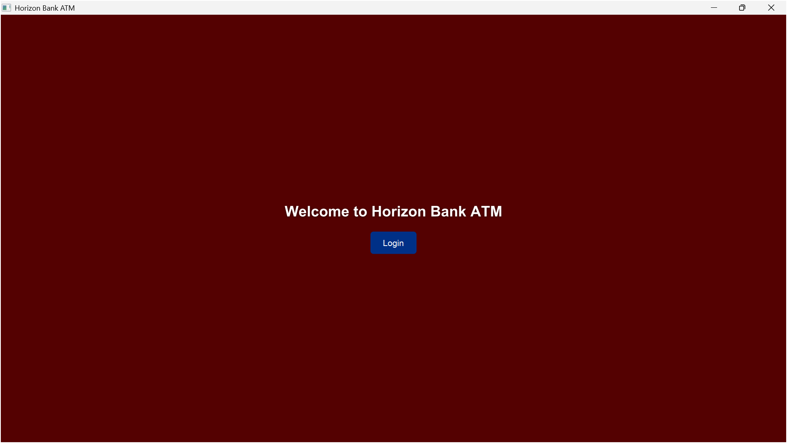
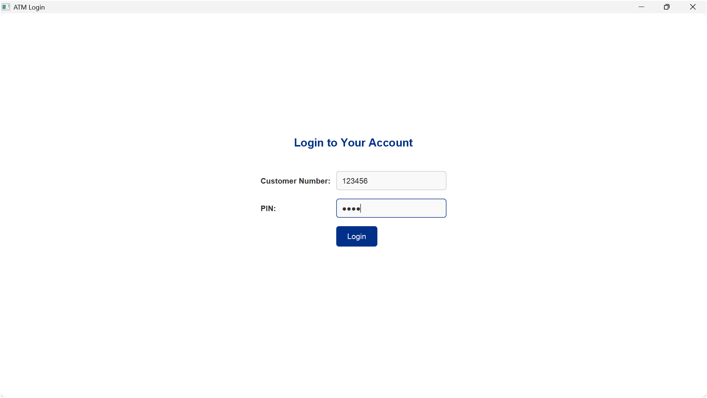
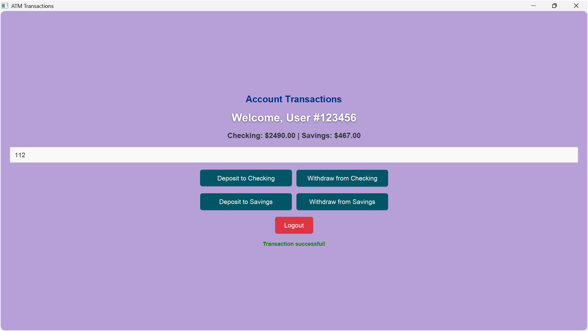

# Horizon Bank ATM System

## Overview

The Horizon Bank ATM System is a Java-based desktop application that simulates an ATM interface, allowing users to perform banking operations such as deposits and withdrawals. Built with **JavaFX** for a modern, elegant user interface, **MySQL** for persistent data storage, and **Maven** for dependency management, this project demonstrates a full-stack application with a focus on usability and clean design.

### Key Features
- **User Authentication**: Secure login with customer number and PIN.
- **Account Management**: View checking and savings account balances.
- **Transactions**: Deposit and withdraw funds from checking or savings accounts, with a clear warning for insufficient funds displayed in bold red.
- **Elegant UI**: A bank-themed interface with a background image on the home screen, styled buttons, and a light blue-gray background on the transaction screen.
- **Error Handling**: Robust handling of invalid inputs, database errors, and insufficient funds.

### Technologies Used
- **Java 17**: Core programming language.
- **JavaFX 21.0.7**: For the graphical user interface.
- **MySQL 9.1**: Database for storing user and account data.
- **Maven**: Build and dependency management.
- **CSS**: Custom styling for the UI.

---

## UI Screenshots

Below are placeholders for UI snapshots. 

### Home Screen
- **Description**: Displays an ATM background image with a "Welcome to Horizon Bank ATM" message and a centered Login button.
- **Snapshot**:  
  

### Login Screen
- **Description**: A clean login interface with fields for customer number and PIN, styled with a bank-blue theme.
- **Snapshot**:  
  

### Transaction Screen
- **Description**: Shows account balances, transaction buttons (Deposit/Withdraw for Checking/Savings), and a warning message for insufficient funds in bold red. Features a light blue-gray background.
- **Snapshot**:  
  

---

## Setup Instructions

Follow these steps to set up and run the Horizon Bank ATM System on your local machine. These instructions assume a Windows environment, but they can be adapted for other operating systems.

### Prerequisites
1. **Java 17**:
   - Download and install [JDK 17](https://www.oracle.com/java/technologies/javase-jdk17-downloads.html) or [AdoptOpenJDK](https://adoptium.net/).
   - Verify: `java -version` (should show Java 17).
2. **Maven**:
   - Download and install [Apache Maven](https://maven.apache.org/download.cgi).
   - Verify: `mvn -version`.
3. **MySQL 9.1**:
   - Install [MySQL Community Server](https://dev.mysql.com/downloads/installer/).
   - Set a root password (e.g., `secret`) during installation.
   - Verify: `mysql -u root -p`.
4. **JavaFX SDK 21.0.7**:
   - Download from [openjfx.io](https://openjfx.io/).
   - Extract to a folder (e.g., `C:\javafx-sdk-21.0.7`).

### Step 1: Clone or Download the Project
- If using Git, clone the repository:
  ```bash
  git clone [your-repository-url]
  cd atm-system
  ```
- Alternatively, download the project ZIP and extract it to `C:\Users\arpit\OneDrive\Desktop\JavaATMProj`.

### Step 2: Set Up the MySQL Database
1. **Start MySQL**:
   ```powershell
   net start mysql
   ```
2. **Create Database**:
   ```powershell
   mysql -u root -p
   ```
   ```sql
   CREATE DATABASE atm_db;
   EXIT;
   ```
3. **Apply Schema**:
   - The schema file (`src/main/resources/db/schema.sql`) creates `users` and `accounts` tables.
   ```powershell
   Get-Content src\main\resources\db\schema.sql | mysql -u root -p atm_db
   ```
   Enter your MySQL root password when prompted.
4. **Add Test Data**:
   - Create `src/main/resources/db/data.sql` with:
     ```sql
     INSERT INTO users (customer_number, pin) VALUES (123456, 1234);
     INSERT INTO accounts (user_id, checking_balance, savings_balance) VALUES (1, 1000.00, 500.00);
     ```
   - Apply:
     ```powershell
     Get-Content src\main\resources\db\data.sql | mysql -u root -p atm_db
     ```

### Step 3: Configure `application.properties`
- Edit `src/main/resources/application.properties`:
  ```properties
  db.url=jdbc:mysql://localhost:3306/atm_db?useSSL=false&serverTimezone=UTC
  db.username=root
  db.password=your_password
  ```
- Replace `your_password` with your MySQL root password.

### Step 4: Configure JavaFX SDK Path
- Update `pom.xml` with the path to your JavaFX SDK’s `lib` folder:
  ```xml
  <javafx.sdk.lib>C:/javafx-sdk-21.0.7/lib</javafx.sdk.lib>
  ```
- Replace `C:/javafx-sdk-21.0.7/lib` with your actual path (e.g., `C:/Users/arpit/javafx-sdk-21.0.7/lib`).

### Step 5: Build the Project
- Navigate to the project directory:
  ```powershell
  cd C:\Users\arpit\OneDrive\Desktop\JavaATMProj
  ```
- Compile:
  ```powershell
  mvn clean compile
  ```

### Step 6: Run the Application
- Run using Maven:
  ```powershell
  mvn exec:java
  ```
- If the JavaFX path isn’t hardcoded in `pom.xml`, specify it:
  ```powershell
  mvn exec:java -Dexec.mainClass=com.atmapp.ui.MainUI -Djavafx.sdk.lib="C:\javafx-sdk-21.0.7\lib"
  ```

---

## Project Structure

Below is the key structure of the project:

```
atm-system/
├── pom.xml                          # Maven configuration
├── src/
│   ├── main/
│   │   ├── java/
│   │   │   └── com/atmapp/
│   │   │       ├── dao/            # Data access objects (DB interactions)
│   │   │       │   ├── AccountDAO.java
│   │   │       │   ├── DBConnection.java
│   │   │       │   └── UserDAO.java
│   │   │       ├── exception/      # Custom exceptions
│   │   │       │   ├── AuthenticationException.java
│   │   │       │   └── InsufficientFundsException.java
│   │   │       ├── model/         # Data models
│   │   │       │   ├── Account.java
│   │   │       │   └── User.java
│   │   │       ├── service/       # Business logic
│   │   │       │   ├── AuthService.java
│   │   │       │   └── TransactionService.java
│   │   │       ├── ui/            # JavaFX UI classes
│   │   │       │   ├── MainUI.java
│   │   │       │   ├── LoginUI.java
│   │   │       │   └── TransactionUI.java
│   │   │       └── util/          # Utility classes
│   │   │           └── ConfigLoader.java
│   │   └── resources/
│   │       ├── css/               # UI styling
│   │       │   └── style.css
│   │       ├── db/                # Database scripts
│   │       │   └── schema.sql
│   │       ├── images/            # UI assets
│   │       │   └── atm-background.jpg
│   │       └── application.properties # Database configuration
│   └── test/
│       └── java/                  # Unit tests
│           └── com/atmapp/
│               └── service/
│                   └── AuthServiceTest.java
└── docs/
    └── design.md                  # Design documentation
```

---

## Usage

1. **Launch the Application**:
   - Run `mvn exec:java` to start the application.
   - The home screen displays an ATM background with a "Welcome to Horizon Bank ATM" message and a Login button.

2. **Log In**:
   - Enter test credentials:
     - **Customer Number**: `123456`
     - **PIN**: `1234`
   - Click "Login" to proceed to the transaction screen.

3. **Perform Transactions**:
   - View checking and savings balances.
   - Enter an amount and select a transaction (Deposit/Withdraw for Checking/Savings).
   - If you attempt to withdraw more than the available balance, a warning message ("Warning: Insufficient funds") appears in bold red.
   - Successful transactions display a green "Transaction successful!" message.
   - Click "Logout" to return to the login screen.

---

## Troubleshooting

- **JavaFX Errors**:
  - **Issue**: "Cannot find symbol" or JavaFX classes not found.
  - **Solution**: Ensure JavaFX SDK is installed and the path is correct in `pom.xml` or the run command.
- **Database Connection Issues**:
  - **Issue**: "Access denied" or "Unknown database".
  - **Solution**: Verify MySQL is running (`net start mysql`), check `application.properties` credentials, and ensure `atm_db` exists.
- **Background Image Not Loading**:
  - **Issue**: Home screen lacks `atm-background.jpg`.
  - **Solution**: Confirm `atm-background.jpg` is in `src/main/resources/images/`. Check console for errors.
- **CSS Not Applied**:
  - **Issue**: UI lacks styling.
  - **Solution**: Ensure `style.css` is in `src/main/resources/css/` and loaded in UI classes.
- **Debugging**:
  - Run with debug logging:
    ```powershell
    mvn clean compile -X
    mvn exec:java -X
    ```

---

## Future Enhancements

- **Transaction History**: Add a feature to view past transactions.
- **Enhanced Security**: Implement password hashing for PINs and session timeouts.
- **UI Improvements**: Add animations for screen transitions or a card reader simulation.
- **Multi-Language Support**: Support multiple languages for accessibility.
- **Unit Tests**: Expand test coverage for `TransactionService` and UI components.

---

## Contributing

Contributions are welcome! To contribute:
1. Fork the repository.
2. Create a feature branch (`git checkout -b feature/your-feature`).
3. Commit changes (`git commit -m "Add your feature"`).
4. Push to the branch (`git push origin feature/your-feature`).
5. Open a pull request.

Please include tests and update documentation as needed.

---

## License

[Add your license here, e.g., MIT License, Apache License 2.0, or specify if proprietary.]

---